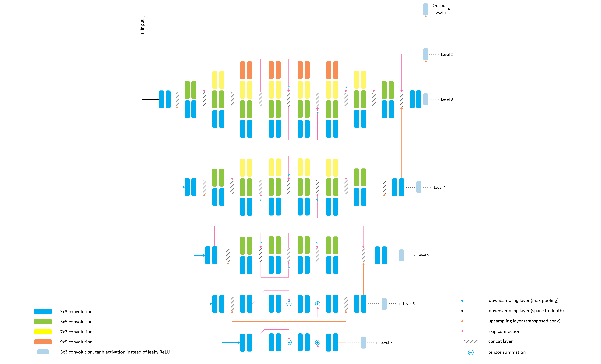

# Rendering Natural Camera Bokeh Effect with Deep Learning

## Abstract

Bokeh is an important artistic effect used to highlight the
main object of interest on the photo by blurring all out-of-
focus areas. While DSLR and system camera lenses can
render this effect naturally, mobile cameras are unable to
produce shallow depth-of-field photos due to a very small
aperture diameter of their optics. Unlike the current solu-
tions simulating bokeh by applying Gaussian blur to image
background, in this implementation of the paper conceptualised by the Andrey Ignatov and team at ETH Zurich Vision Lab, we try to learn a realistic
shallow focus technique directly from the photos produced
by DSLR cameras.

## Code

The code for the model, data input preprocessing and training the model, can be found as a jupyter notebook [here](./PyNET.ipynb).  
The summary of the PyNET CNN, built using `tensorflow.keras.Model` functional API, can be found [here](./summary). It shows all the layers in the model, with their input and output dimensions, and number of parameters in each layer. The total number of parameters in PyNET is 48.9M.

### PyNET Architecture

	

## Report

My report with details on the project, its theory and implementation can be found [here](./WiDS_Report.pdf).

## Data

You can find the training data with 4694 images (original and its bokeh counterpart) (3.4GB) [here](https://drive.google.com/file/d/1tNf8teMRI8NlWu-h_F4Q7pIG7nchQhfs/view?usp=share_link).

You can download the pretrained VGG-19 Model [here](https://polybox.ethz.ch/index.php/s/7z5bHNg5r5a0g7k).

